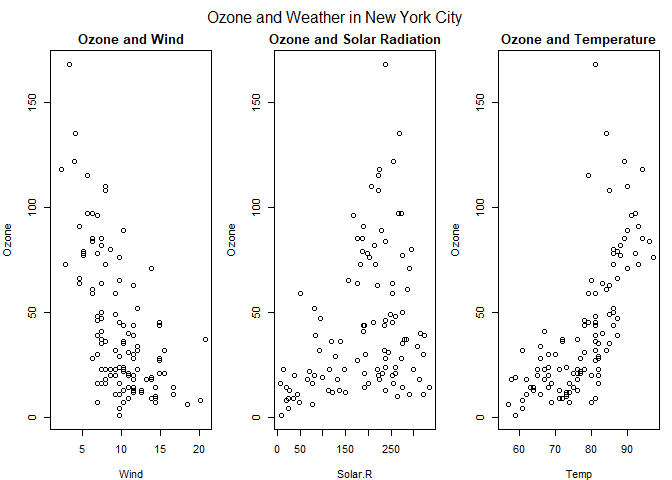
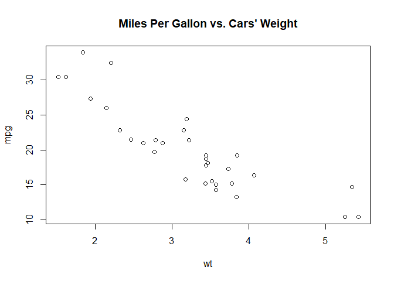

`Week 1` Exploratory Data Analysis
================

-   👨🏻‍💻 Author: Anderson H Uyekita
-   📚 Specialization: <a
    href="https://www.coursera.org/specializations/data-science-foundations-r"
    target="_blank" rel="noopener">Data Science: Foundations using R
    Specialization</a>
-   📖 Course:
    <a href="https://www.coursera.org/learn/exploratory-data-analysis"
    target="_blank" rel="noopener">Exploratory Data Analysis</a>
    -   🧑‍🏫 Instructor: Roger D Peng
-   📆 Week 1
    -   🚦 Start: Wednesday, 25 May 2022
    -   🏁 Finish: Wednesday, 25 May 2022

------------------------------------------------------------------------

#### Assignments & Deliverables

-   💻 Swirl
    -   Principles of Analytic Graphs
    -   Exploratory Graphs
    -   Graphics Devices in R
    -   Plotting Systems
    -   Base Plotting System
-   [📝 Quiz 1](./quiz-1_exploratory-data-analysis.md)
-   [🚀 Course Project 1
    Repository](https://github.com/AndersonUyekita/exploratory-data-analysis_course-project-1)

------------------------------------------------------------------------

#### Slides

-   Lesson 1: Graphs <a href="" id="graphs"></a>
    -   [Principles of Analytic
        Graphics](./slides/1_1_1_PrinciplesofAnalyticGraphics.pdf)
    -   [Exploratory Graphs](./slides/1_1_2_ExploratoryGraphs.pdf)
-   Lesson 2: Plotting <a href="" id="plotting"></a>
    -   [Plotting Systems in
        R](./slides/1_2_1_Plotting%20Systems%20in%20R.pdf)
    -   [Base Plotting System](./slides/1_2_2_PlottingBase.pdf)
-   Lesson 3: Graphics Devices <a href="" id="graphics_devices"></a>
    -   [Graphics Devices in R](./slides/1_3_GraphicsDevicesinR.pdf)

------------------------------------------------------------------------

#### Description

> This week covers the basics of analytic graphics and the base plotting
> system in R. We’ve also included some background material to help you
> install R if you haven’t done so already.

------------------------------------------------------------------------

## Class Notes

### [<kbd>Lesson 1</kbd>](#graphs) Principles of Analytic Graphics

**Summary**

-   Principle 1: Show comparisons

    > -   Evidence for a hypothesis is always relative to another
    >     competing hypothesis.
    > -   Always ask “Compared to What?”

-   Principle 2: Show causality, mechanism, explanation

    > -   What is your causal framework for thinking about a question?

-   Principle 3: Show multivariate data

    > -   Multivariate = more than 2 variables
    > -   The real world is multivariate
    > -   Need to “escape flatland”

-   Principle 4: Integrate multiple modes of evidence

    > -   Completely integrate words, numbers, images, diagrams
    > -   Data graphics should make use of many modes of data
    >     presentation
    > -   Don’t let the tool drive the analysis

-   Principle 5: Describe and document the evidence

    > -   A data graphic should tell a complete story that is credible

-   Principle 6: Content is king

    > -   Analytical presentations ultimately stand or fall depending on
    >     the quality, relevance, and integrity of their content

### [<kbd>Lesson 1</kbd>](#graphs) Exploratory Graphs

> -   To understand data properties
> -   To find patterns in data
> -   To suggest modeling strategies
> -   To “debug” analyses
> -   To communicate results

The exploratory graphs are really about the **first four** things on
this list.

Characteristics of exploratory graphs:

> -   They are made quickly
> -   A large number are made
> -   The goal is for personal understanding
> -   Axes/legends are generally cleaned up (later)
> -   Color/size are primarily used for information

**Summary**

> -   Exploratory plots are “quick and dirty”
> -   Let you summarize the data (usually graphically) and highlight any
>     broad features
> -   Explore basic questions and hypotheses (and perhaps rule them out)
> -   Suggest modeling strategies for the “next step”

### [<kbd>Lesson 2</kbd>](#plotting) Plotting Systems in R

**Summary**

There are three basic ways to plot a graph in R.

1.  Base Plotting System: “artist’s palette” model

    > -   Convenient, mirrors how we think of building plots and
    >     analyzing data
    > -   Can’t go back once plot has started (i.e. to adjust margins);
    >     need to plan in advance
    > -   Difficult to “translate” to others once a new plot has been
    >     created (no graphical “language”)
    > -   Plot is just a series of R commands

2.  Lattice: Entire plot specified by one function; conditioning

    > -   Plots are created with a single function call (xyplot, bwplot,
    >     etc.)
    > -   Most useful for conditioning types of plots: Looking at how y
    >     changes with x across levels of z
    > -   Things like margins/spacing set automatically because entire
    >     plot is specified at once
    > -   Good for putting many many plots on a screen
    > -   Sometimes awkward to specify an entire plot in a single
    >     function call
    > -   Annotation in plot is not especially intuitive
    > -   Use of panel functions and subscripts difficult to wield and
    >     requires intense preparation
    > -   Cannot “add” to the plot once it is created

3.  ggplot2: Mixes elements of Base and Lattice

    > -   Splits the difference between base and lattice in a number of
    >     ways
    > -   Automatically deals with spacings, text, titles but also
    >     allows you to annotate by “adding” to a plot
    > -   Superficial similarity to lattice but generally easier/more
    >     intuitive to use
    > -   Default mode makes many choices for you (but you can still
    >     customize to your heart’s desire)

### [<kbd>Lesson 2</kbd>](#plotting) Base Plotting System in R

Some Important Base Graphics Parameters Some Important Base Graphics
Parameters

-   `pch`: the plotting symbol (default is open circle)
-   `lty`: the line type (default is solid line), can be dashed, dotted,
    etc.
-   `lwd`: the line width, specified as an integer multiple
-   `col`: the plotting color, specified as a number, string, or hex
    code; the colors() function gives
-   `you` a vector of colors by name
-   `xlab`: character string for the x-axis label
-   `ylab`: character string for the y-axis label

The par() function is used to specify global graphics parameters

-   `las`: the orientation of the axis labels on the plot
-   `bg`: the background color
-   `mar`: the margin size
-   `oma`: the outer margin size (default is 0 for all sides)
-   `mfrow`: number of plots per row, column (plots are filled row-wise)
-   `mfcol`: number of plots per row, column (plots are filled
    column-wise)

``` r
# Loading toy datasets.
library(datasets)

# Defining global parameters
par(mfrow = c(1, 3),      # c("number of rows", "number of columns")
    mar = c(4, 4, 2, 1),  # c(bottom, left, top, right)
    oma = c(0, 0, 2, 0))  # c(bottom, left, top, right)

# Simple plot as example.
with(airquality, {
    plot(Wind, Ozone, main = "Ozone and Wind")
    plot(Solar.R, Ozone, main = "Ozone and Solar Radiation")
    plot(Temp, Ozone, main = "Ozone and Temperature")
    mtext("Ozone and Weather in New York City", outer = TRUE)
})
```

<!-- -->

**Summary**

> -   Plots in the base plotting system are created by calling
>     successive R functions to “build up” a plot
> -   Plotting occurs in two stages:
>     -   Creation of a plot
>     -   Annotation of a plot (adding lines, points, text, legends)
> -   The base plotting system is very flexible and offers a high degree
>     of control over plotting

### [<kbd>Lesson 3</kbd>](#graphics_devices) Graphics Devices in R

Display a plot in the R viewer panel.

``` r
# Step 1 - Loading datasets to use mtcars.
library(datasets)

# Step 2 - Creating a Graph
with(mtcars, plot(wt, mpg)) # This is an alternative to:
                            # plot(mtcars$wt, mtcars$mpg)

# Step 3 - Adding notations
title(main = "Miles Per Gallon vs. Cars' Weight")
```

<!-- -->

Exporting the graph into an external file called `myplot.pdf`, and
storing in the data folder.

``` r
# Open PDF device to create the file and store it in the data folder.
grDevices::pdf(file = "./data/myplot.pdf")

# Previous graph example here.
with(mtcars, plot(wt, mpg))
title(main = "Miles Per Gallon vs. Cars' Weight")

# Closing the device
dev.off()
```

    ## png 
    ##   2

There are two basic types of file devices: vector and bitmap devices

-   Vector formats: `pdf`, `svg`, `win.metafile`, and `postscript`, and;
-   Bitmap formats: `png`, `jpeg`, `tiff`, and `bmp`.

**Summary**

> -   Plots must be created on a graphics device
> -   The default graphics device is almost always the screen device,
>     which is most useful for exploratory analysis
> -   File devices are useful for creating plots that can be included in
>     other documents or sent to other people
> -   For file devices, there are vector and bitmap formats
>     -   Vector formats are good for line drawings and plots with solid
>         colors using a modest number of points
>     -   Bitmap formats are good for plots with a large number of
>         points, natural scenes or webbased plots
