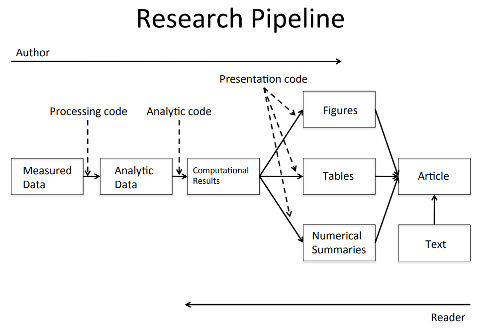

`Quiz 1` Reproducible Research
================

-   👨🏻‍💻 Author: Anderson H Uyekita
-   📚 Specialization: <a
    href="https://www.coursera.org/specializations/data-science-foundations-r"
    target="_blank" rel="noopener">Data Science: Foundations using R
    Specialization</a>
-   📖 Course:
    <a href="https://www.coursera.org/learn/reproducible-research"
    target="_blank" rel="noopener">Reproducible Research</a>
    -   🧑‍🏫 Instructor: Roger D Peng
-   📆 Week 1
    -   🚦 Start: Monday, 20 June 2022
    -   🏁 Finish: Wednesday, 22 June 2022
-   🌎 Rpubs: [Interactive
    Document](https://rpubs.com/AndersonUyekita/quiz-1_reproducible-research)

------------------------------------------------------------------------

## Question 1

Suppose I conduct a study and publish my findings. Which of the
following is an example of a replication of my study?

-   [ ] I take my own data, analyze it again, and publish new findings.
-   [ ] I give my data to an independent investigator at another
    institution, she analyzes the data and gets the same results as I
    originally obtained.
-   [x] An investigator at another institution conducts a study
    addressing the same question, collects her own data, analyzes it
    separately from me, and publishes her own findings.
-   [ ] An investigator at another institution conducts a study
    addressing a different scientific question and publishes her
    findings.

**Answer**

Someone could read your paper and try to replicate it using local data.

## Question 2

Which of the following is a requirement for a published data analysis to
be reproducible?

-   [ ] The investigator’s final publication is made available free of
    charge.
-   [ ] The analysis is conducted on a variant of the Unix operating
    system.
-   [x] The full computer code for doing the data analysis is made
    publicly available.
-   [ ] The data analysis is conducted using R.

**Answer**

Reproducible Research: Make analytic data and code available so that
others may reproduce findings.

## Question 3

Which of the following is an example of a reproducible study?

-   [ ] The study’s analytic data are publicly available, but the
    computer code is not.
-   [ ] The study’s analytic data and computer code are not publicly
    available, but the study was simple enough to be repeated by an
    independent investigator.
-   [ ] The study’s original authors re-run their computer code on their
    analytic data and confirm publicly that the findings match those of
    the published results.
-   [x] The study’s analytic data and computer code for the data
    analysis are publicly available. When the code is run on the
    analytic data, the findings are identical to the published results.

**Answer**

Reproducible Research: Make analytic data and code available so that
others may reproduce findings.

## Question 4

Which of the following is a reason that a study might NOT be fully
**replicated**?

-   [ ] The original study had null findings.
-   [ ] The original study was conducted by a well-known investigator.
-   [x] The original study was very expensive and there is no money to
    repeat it in a different setting.
-   [ ] The original investigator does not want to make the analytic
    data available.

**Answer**

Some results can not be replicated:

-   No time, opportunist;
-   No money, and;
-   Unique

## Question 5

Which of the following is a reason why publishing **reproducible
research** is increasingly important?

-   [ ] Most studies today are small-scale and easily replicated.
-   [ ] Computing power is limited today, making it difficult to apply
    sophisticated statistical methods.
-   [x] New technologies are increasing the rate of data collection,
    creating datasets that are more complex and extremely high
    dimensional.
-   [ ] The statistical methods for most studies can be accurately
    described using plain language.

**Answer**

New technologies increasing data collection throughput; data are more
complex and extremely high dimensional

## Question 6

What is the role of processing code in the research pipeline?

-   [x] It transforms the measured data into analytic data.
-   [ ] It transforms the computational results into figures and tables.
-   [ ] It transforms the analytic data into computational results.
-   [ ] It conducts the statistical analysis of the primary outcome.

**Answer**

## Question 7

Which is a goal of literate statistical programming?

-   [x] Combine explanatory text and data analysis code in a single
    document.
-   [ ] Separate figures and tables from other data analytic summaries.
-   [ ] Require that data analysis summaries are always written in
    LaTeX.
-   [ ] Ensure that data analysis documents are always exported in PDF
    format.

**Answer**

-   **An article is a stream of text and code**
-   Analysis code is divided into text and code “chunks”
-   Each code chunk loads data and computes results
-   Presentation code formats results
-   Article text explains what is going on
-   Literate programs can be weaved to produce human-readable documents
    and tangled to produce machine-readable documents.

## Question 8

What does it mean to weave a literate statistical program?

-   [ ] Transform a literate program from R to python.
-   [x] Transform the literate program into a human readable document.
-   [ ] Compress the literate program so that it takes up less space.
-   [ ] Transform the literate program into a machine readable code
    file.

**Answer**

-   An article is a stream of text and code
-   Analysis code is divided into text and code “chunks”
-   Each code chunk loads data and computes results
-   Presentation code formats results
-   Article text explains what is going on
-   **Literate programs can be weaved to produce human-readable
    documents and tangled to produce machine-readable documents.**

## Question 9

Which of the following is required to implement a literate programming
system?

-   [x] A programming language like R.
-   [ ] A web server for publishing documents.
-   [ ] A Unix-based computer system.
-   [ ] A program that views PDF files.

**Answer**

-   Literate programming is a general concept that requires:
    1.  A documentation language (human readable)
    2.  A programming language (machine readable)
-   **Sweave uses `Latex` and `R` as the documentation and programming
    languages**
-   Sweave was developed by Friedrich Leisch and maintained by R core

## Question 10

What is one way in which the knitr system differs from Sweave?

-   [ ] knitr was developed by Friedrich Leisch.
-   [x] knitr allows for the use of markdown instead of LaTeX.
-   [ ] knitr lacks features like caching of code chunks.
-   [ ] knitr is written in python instead of R.

**Answer**

-   Sweave has many limitations
    -   **Focused primarily on Latex, a difficult to learn markup
        language used only by weirdos**
    -   Lacks features like caching, multiple plots per chunk, mixing
        programming languages and many other technical items
    -   Not frequently updated or very actively developed.
