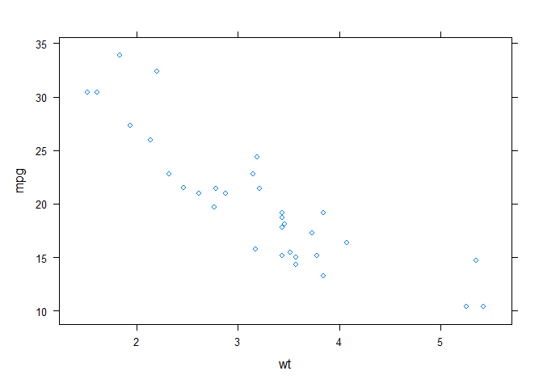
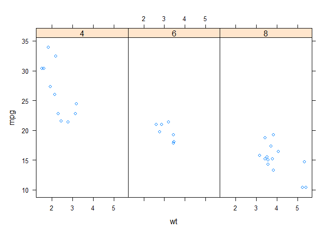

`Week 2` Exploratory Data Analysis
================

-   👨🏻‍💻 Author: Anderson H Uyekita
-   📚 Specialization: <a
    href="https://www.coursera.org/specializations/data-science-foundations-r"
    target="_blank" rel="noopener">Data Science: Foundations using R
    Specialization</a>
-   📖 Course:
    <a href="https://www.coursera.org/learn/exploratory-data-analysis"
    target="_blank" rel="noopener">Exploratory Data Analysis</a>
    -   🧑‍🏫 Instructor: Roger D Peng
-   📆 Week 2
    -   🚦 Start: Tuesday, 07 June 2022
    -   🏁 Finish: Wednesday, 08 June 2022

------------------------------------------------------------------------

#### Assignments & Deliverables

-   💻 Swirl
    -   Lattice Plotting System
    -   Working with Colors
    -   GGPlot2 Part1
    -   GGPlot2 Part2
    -   GGPlot2 Extras
-   [📝 Quiz 2](./quiz-2_exploratory-data-analysis.md)

------------------------------------------------------------------------

#### Slides

-   Lesson 1: Lattice Plotting System <a href="" id="lesson-1"></a>
    -   [Lattice Plotting System](./slides/2_1_plotting-lattice.pdf)
-   Lesson 2: ggplot2 <a href="" id="lesson-2"></a>
    -   [ggplot2](./slides/2_2_ggplot-2.pdf)

------------------------------------------------------------------------

#### Description

> Welcome to Week 2 of Exploratory Data Analysis. This week covers some
> of the more advanced graphing systems available in R: the Lattice
> system and the ggplot2 system. While the base graphics system provides
> many important tools for visualizing data, it was part of the original
> R system and lacks many features that may be desirable in a plotting
> system, particularly when visualizing high dimensional data. The
> Lattice and ggplot2 systems also simplify the laying out of plots
> making it a much less tedious process.

------------------------------------------------------------------------

## Class Notes

### [<kbd>Lesson 1</kbd>](#lesson-1) Lattice Plotting System in R

**The Lattice Plotting System**

The lattice plotting system is implemented using `lattice` and `grid`
packages.

> -   lattice: contains code for producing Trellis graphics, which are
>     independent of the “base” graphics system; includes functions like
>     `xyplot`, `bwplot`, `levelplot`
> -   grid: implements a different graphing system independent of the
>     “base” system; the lattice package builds on top of grid
> -   The lattice plotting system does not have a “two-phase” aspect
>     with separate plotting and annotation like in base plotting
> -   All plotting/annotation is done at once with a single function
>     call

**Lattice Functions**

> -   `xyplot`: this is the main function for creating scatterplots
> -   `bwplot`: box-and-whiskers plots (“boxplots”)
> -   `histogram`: histograms
> -   `stripplot`: like a boxplot but with actual points
> -   `dotplot`: plot dots on “violin strings”
> -   `splom`: scatterplot matrix; like `pairs` in base plotting system
> -   `levelplot`, contourplot: for plotting “image” data

Lattice functions generally take a formula for their first argument,
usually of the form

    xyplot(y ~ x | f * g, data)

We use the formula notation here, hence the `~` on the left of the `~`
is the y-axis variable, on the right is the x-axis variable.

``` r
library(datasets)
library(lattice)

# Scatter plot example.
xyplot(x = mpg ~ wt, data = mtcars)
```

<!-- -->

`f` and `g` are conditioning variables — they are optional, the `*`
indicates an interaction between two variables.

``` r
# Scatter plot example with facets.
xyplot(x = mpg ~ wt | factor(cyl), data = mtcars)
```

<!-- -->

The second argument is the data frame or list from which the variables
in the formula should be looked up.

-   If no data frame or list is passed, then the parent frame is used.
-   If no other arguments are passed, there are defaults that can be
    used.

**Lattice Behavior**

Lattice functions behave differently from base graphics functions in one
critical way.

> -   Base graphics functions plot data directly to the graphics device
>     (screen, PDF file, etc.)
> -   Lattice graphics functions return an object of class trellis
> -   The print methods for lattice functions actually do the work of
>     plotting the data on the graphics device.
> -   Lattice functions return “plot objects” that can, in principle, be
>     stored (but it’s usually better to just save the code + data).
> -   On the command line, trellis objects are *auto-printed* so that it
>     appears the function is plotting the data

**Summary**

> -   Lattice plots are constructed with a single function call to a
>     core lattice function (e.g. xyplot)
> -   Aspects like margins and spacing are automatically handled and
>     defaults are usually sufficient
> -   The lattice system is ideal for creating conditioning plots where
>     you examine the same kind of plot under many different conditions
> -   Panel functions can be specified/customized to modify what is
>     plotted in each of the plot panels

### [<kbd>Lesson 2</kbd>](#lesson-2) Plotting with ggplot2

**What is ggplot2?**

Grammer of Graphics

> “In brief, the grammar tells us that a statistical graphic is a
> mapping from data to aesthetic attributes (colour, shape, size) of
> geometric objects (points, lines, bars). The plot may also contain
> statistical transformations of the data and is drawn on a specific
> coordinate system” – from ggplot2 book

Important points:

> -   An implementation of The Grammar of Graphics by Leland Wilkinson
> -   Written by Hadley Wickham (while he was a graduate student at Iowa
>     State)
> -   A “third” graphics system for R (along with base and lattice)
> -   Grammar of graphics represents an abstraction of graphics
>     ideas/objects
> -   Think “verb”, “noun”, “adjective” for graphics
> -   Allows for a “theory” of graphics on which to build new graphics
>     and graphics objects
> -   “Shorten the distance from mind to page”

**Plotting Systems in R**

<table>
<tbody>
<tr>
<td>
Base
</td>
<td>
Lattice
</td>
<td>
ggplot
</td>
</tr>
<tr>
<td>
<ul>
<li>
“Artist’s palette” model
</li>
<li>
Start with blank canvas and build up from there
</li>
<li>
Start with plot function (or similar)
</li>
<li>
Use annotation functions to add/modify (text, lines, points, axis)
</li>
<li>
Convenient, mirrors how we think of building plots and analyzing data
</li>
<li>
Can’t go back once plot has started (i.e. to adjust margins); need to
plan in advance
</li>
<li>
Difficult to “translate” to others once a new plot has been created (no
graphical “language”)
</li>
<li>
Plot is just a series of R commands
</li>
</ul>
</td>
<td>
<ul>
<li>
Plots are created with a single function call (xyplot, bwplot,etc.)
</li>
<li>
Most useful for conditioning types of plots: Looking at how <span
id="MathJax-Element-1-Frame" class="MathJax"><span id="MathJax-Span-1"
class="math"><span id="MathJax-Span-2" class="mrow"><span
id="MathJax-Span-3" class="mi">y</span></span></span></span> changes
with <span id="MathJax-Element-2-Frame" class="MathJax"><span
id="MathJax-Span-4" class="math"><span id="MathJax-Span-5"
class="mrow"><span id="MathJax-Span-6"
class="mi">x</span></span></span></span> across levels of <span
id="MathJax-Element-3-Frame" class="MathJax"><span id="MathJax-Span-7"
class="math"><span id="MathJax-Span-8" class="mrow"><span
id="MathJax-Span-9" class="mi">z</span></span></span></span>
</li>
<li>
Things like margins/spacing set automatically because entire plot is
specified at once
</li>
<li>
Good for putting many many plots on a screen
</li>
<li>
Sometimes awkward to specify an entire plot in a single function call
</li>
<li>
Annotation in plot is not intuitive
</li>
<li>
Use of panel functions and subscripts difficult to wield and requires
intense preparation
</li>
<li>
Cannot “add” to the plot once it’s created
</li>
</ul>
</td>
<td>
<ul>
<li>
Split the difference between base and lattice
</li>
<li>
Automatically deals with spacings, text, titles but also allows you to
annotate by “adding”
</li>
<li>
Superficial similarity to lattice but generally easier/more intuitive to
use
</li>
<li>
Default mode makes many choices for you (but
you <em>can</em> customize!)
</li>
</ul>
</td>
</tr>
</tbody>
</table>

**The basics: `qplot()`**

> -   The qplot() function is the analog to plot() but with many
>     built-in features
> -   Syntax somewhere in between base/lattice
> -   Produces very nice graphics, essentially publication ready (if you
>     like the design)
> -   Difficult to go against the grain/customize (don’t bother; use
>     full ggplot2 power in that case)

**Basic Components of a ggplot2 Plot**

> -   A data frame
> -   aesthetic mappings: how data are mapped to color, size
> -   geoms: geometric objects like points, lines, shapes.
> -   facets: for conditional plots.
> -   stats: statistical transformations like binning, quantiles,
>     smoothing.
> -   scales: what scale an aesthetic map uses (example: male = red,
>     female = blue).
> -   coordinate system
> -   When building plots in ggplot2 (rather than using qplot) the
>     “artist’s palette” model may be the closest analogy
> -   Plots are built up in layers
> -   Plot the data
>     -   Overlay a summary
>     -   Metadata and annotation

**Annotation**

> -   Labels: xlab(), ylab(), labs(), ggtitle()
> -   Each of the “geom” functions has options to modify
> -   For things that only make sense globally, use theme()
>     -   Example: theme(legend.position = “none”)
> -   Two standard appearance themes are included
>     -   theme_gray(): The default theme (gray background)
>     -   theme_bw(): More stark/plain

**Summary**

> -   ggplot2 is very powerful and flexible if you learn the “grammar”
>     and the various elements that can be tuned/modified
> -   Many more types of plots can be made; explore and mess around with
>     the package (references mentioned in Part 1 are useful)
